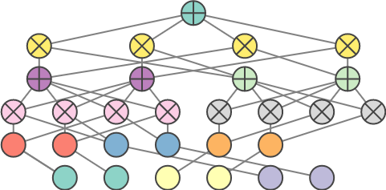

[](https://badge.fury.io/py/libspn-keras)
[](https://github.com/pronobis/libspn-keras/actions?workflow=tests)
[](https://pypi.org/project/libspn-keras/)
[](https://libspn-keras.readthedocs.io/)

# LibSPN Keras
LibSPN Keras is a library for constructing and training Sum-Product Networks. By leveraging the
Keras framework with a TensorFlow backend, it offers both ease-of-use and scalability. Whereas the
previously available `libspn` focused on scalability, `libspn-keras` offers scalability **and**
a straightforward Keras-compatible interface.



## Contents
* [API Reference](reference.md)

## Documentation
The documentation of the library is hosted on [ReadTheDocs](https://libspn-keras.readthedocs.io/en/latest/index.html).

## What are SPNs?

Sum-Product Networks (SPNs) are a probabilistic deep architecture with solid theoretical
foundations, which demonstrated state-of-the-art performance in several domains. Yet, surprisingly,
there are no mature, general-purpose SPN implementations that would serve as a platform for the
community of machine learning researchers centered around SPNs. LibSPN Keras is a new
general-purpose Python library, which aims to become such a platform. The library is designed to
make it straightforward and effortless to apply various SPN architectures to large-scale datasets
and problems. The library achieves scalability and efficiency, thanks to a tight coupling with
TensorFlow and Keras, two frameworks already in use by a large community of researchers and
developers in multiple domains.

## Dependencies
Currently, LibSPN Keras is tested with `tensorflow>=2.0` and `tensorflow-probability>=0.8.0`.

## Installation

```
pip install libspn-keras
```

## Note on stability of the repo
Currently, the repo is in an alpha state. Hence, one can expect some sporadic breaking changes.

## Feature Overview
- Gradient based training for generative and discriminative problems
- Hard EM training for generative problems
- Hard EM training with unweighted weights for generative problems
- Soft EM training (experimental) for generative problems
- [Deep Generalized Convolutional Sum-Product Networks](https://arxiv.org/abs/1902.06155)
- SPNs with arbitrary decompositions
- Fully compatible with Keras and TensorFlow 2.0
- Input dropout
- Sum child dropout
- Image completion
- Model saving
- Discrete inputs through an `IndicatorLeaf` node
- Continuous inputs through `NormalLeaf`, `CauchyLeaf` or `LaplaceLeaf`. Each of these distributions support both
univariate as well as *multivariate* inputs.

## Examples / Tutorials
1. **Benchmark**: `libspn-keras` and Einsum Networks. [](https://colab.research.google.com/github/pronobis/libspn-keras/blob/master/examples/notebooks/Benchmark%20With%20Einsum%20Networks.ipynb)
2. **Image Classification**: A Deep Generalized Convolutional Sum-Product Network (DGC-SPN). [](https://colab.research.google.com/github/pronobis/libspn-keras/blob/master/examples/notebooks/DGC-SPN%20Image%20Classification.ipynb)
3. **Image Completion**: A Deep Generalized Convolutional Sum-Product Network (DGC-SPN). [](https://colab.research.google.com/github/pronobis/libspn-keras/blob/master/examples/notebooks/DGC-SPN%20Image%20Completion.ipynb)
4. **Understanding region SPNs** [](https://colab.research.google.com/github/pronobis/libspn-keras/blob/master/examples/notebooks/Understanding%20Region%20SPNs.ipynb)
5. More to come, and if you would like to see a tutorial on anything in particular
please raise an issue!

Check out the way we can build complex DGC-SPNs in a layer-wise fashion:
```python
import libspn_keras as spnk
from tensorflow import keras

spnk.set_default_sum_op(spnk.SumOpGradBackprop())
spnk.set_default_accumulator_initializer(
    keras.initializers.TruncatedNormal(stddev=0.5, mean=1.0)
)

sum_product_network = keras.Sequential([
  spnk.layers.NormalizeStandardScore(input_shape=(28, 28, 1)),
  spnk.layers.NormalLeaf(
      num_components=16,
      location_trainable=True,
      location_initializer=keras.initializers.TruncatedNormal(
          stddev=1.0, mean=0.0)
  ),
  # Non-overlapping products
  spnk.layers.Conv2DProduct(
      depthwise=True,
      strides=[2, 2],
      dilations=[1, 1],
      kernel_size=[2, 2],
      padding='valid'
  ),
  spnk.layers.Local2DSum(num_sums=16),
  # Non-overlapping products
  spnk.layers.Conv2DProduct(
      depthwise=True,
      strides=[2, 2],
      dilations=[1, 1],
      kernel_size=[2, 2],
      padding='valid'
  ),
  spnk.layers.Local2DSum(num_sums=32),
  # Overlapping products, starting at dilations [1, 1]
  spnk.layers.Conv2DProduct(
      depthwise=True,
      strides=[1, 1],
      dilations=[1, 1],
      kernel_size=[2, 2],
      padding='full'
  ),
  spnk.layers.Local2DSum(num_sums=32),
  # Overlapping products, with dilations [2, 2] and full padding
  spnk.layers.Conv2DProduct(
      depthwise=True,
      strides=[1, 1],
      dilations=[2, 2],
      kernel_size=[2, 2],
      padding='full'
  ),
  spnk.layers.Local2DSum(num_sums=64),
  # Overlapping products, with dilations [2, 2] and full padding
  spnk.layers.Conv2DProduct(
      depthwise=True,
      strides=[1, 1],
      dilations=[4, 4],
      kernel_size=[2, 2],
      padding='full'
  ),
  spnk.layers.Local2DSum(num_sums=64),
  # Overlapping products, with dilations [2, 2] and 'final' padding to combine
  # all scopes
  spnk.layers.Conv2DProduct(
      depthwise=True,
      strides=[1, 1],
      dilations=[8, 8],
      kernel_size=[2, 2],
      padding='final'
  ),
  spnk.layers.SpatialToRegions(),
  # Class roots
  spnk.layers.DenseSum(num_sums=10),
  spnk.layers.RootSum(return_weighted_child_logits=True)
])

sum_product_network.summary(line_length=100)
```

Which produces:
```
Model: "sequential"
_________________________________________________________________
Layer (type)                 Output Shape              Param #
=================================================================
normal_leaf (NormalLeaf)     (None, 28, 28, 16)        25088
_________________________________________________________________
conv2d_product (Conv2DProduc (None, 14, 14, 16)        4
_________________________________________________________________
local2d_sum (Local2DSum)     (None, 14, 14, 16)        50176
_________________________________________________________________
conv2d_product_1 (Conv2DProd (None, 7, 7, 16)          4
_________________________________________________________________
local2d_sum_1 (Local2DSum)   (None, 7, 7, 32)          25088
_________________________________________________________________
conv2d_product_2 (Conv2DProd (None, 8, 8, 32)          4
_________________________________________________________________
local2d_sum_2 (Local2DSum)   (None, 8, 8, 32)          65536
_________________________________________________________________
conv2d_product_3 (Conv2DProd (None, 10, 10, 32)        4
_________________________________________________________________
local2d_sum_3 (Local2DSum)   (None, 10, 10, 64)        204800
_________________________________________________________________
conv2d_product_4 (Conv2DProd (None, 14, 14, 64)        4
_________________________________________________________________
local2d_sum_4 (Local2DSum)   (None, 14, 14, 64)        802816
_________________________________________________________________
conv2d_product_5 (Conv2DProd (None, 8, 8, 64)          4
_________________________________________________________________
spatial_to_regions (SpatialT (None, 1, 1, 4096)        0
_________________________________________________________________
dense_sum (DenseSum)         (None, 1, 1, 10)          40960
_________________________________________________________________
root_sum (RootSum)           (None, 10)                10
=================================================================
Total params: 1,214,498
Trainable params: 1,201,930
Non-trainable params: 12,568
_________________________________________________________________
```

## TODOs
- Structure learning
- Advanced regularization e.g. pruning or auxiliary losses on weight accumulators
